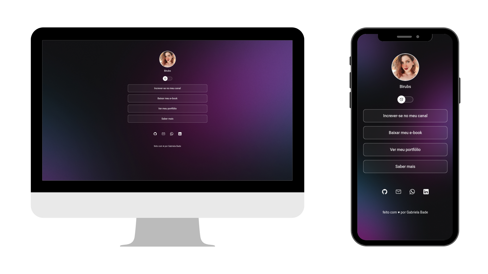
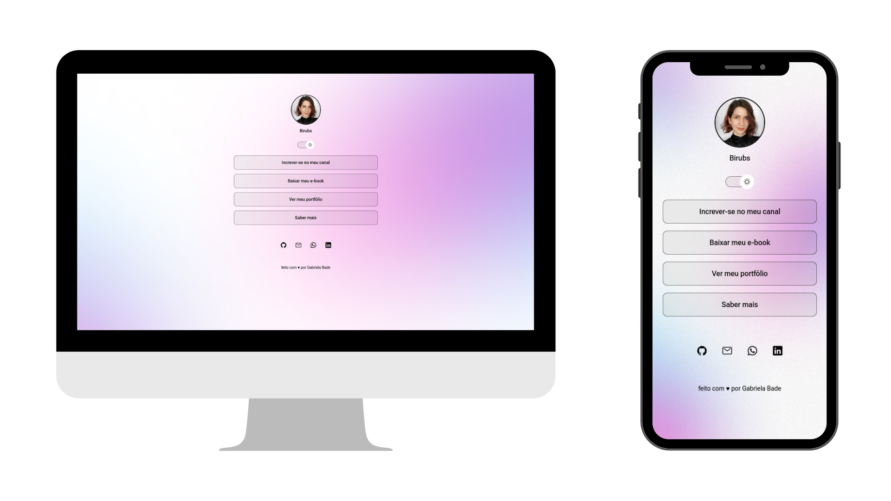

# Business Card

## Sobre o Projeto

O Business Card é um agregador de links projetado para ser utilizado como um cartão de visitas online. Ele permite que você compartilhe suas informações e links relevantes de maneira rápida e fácil.

Acesse o projeto online [aqui](https://gabrielabade.github.io/business-card/).
<h2> Tecnologias utilizadas</h2>
 
 
 
 
 
 

## Preview

